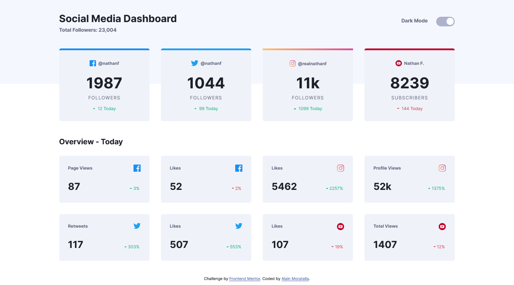
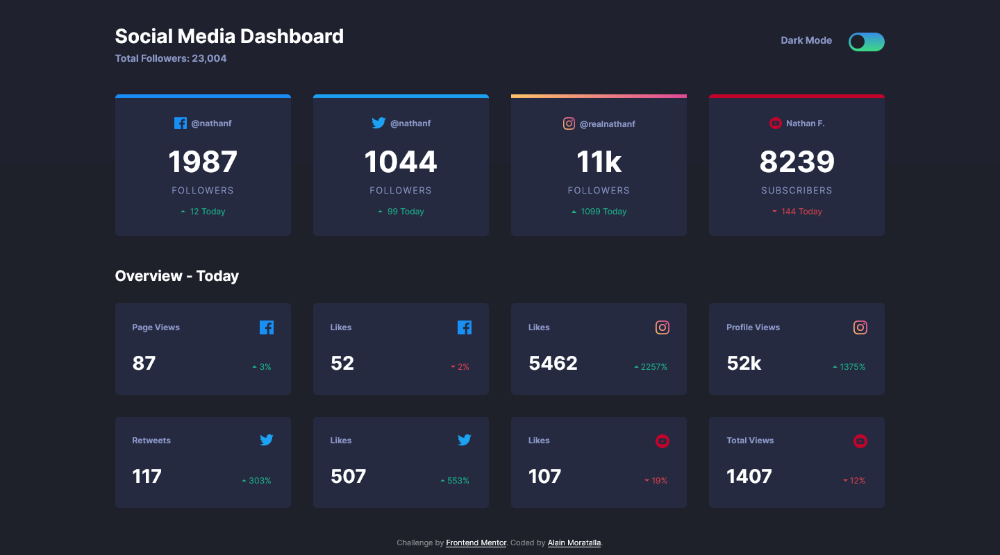
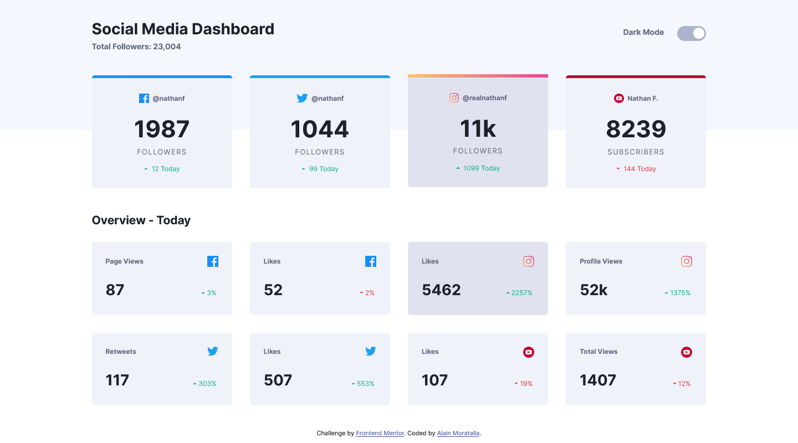
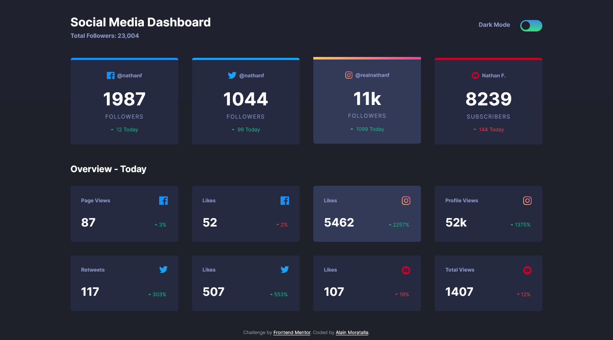
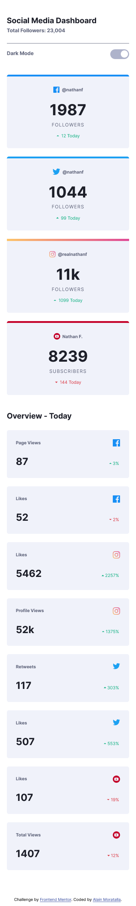
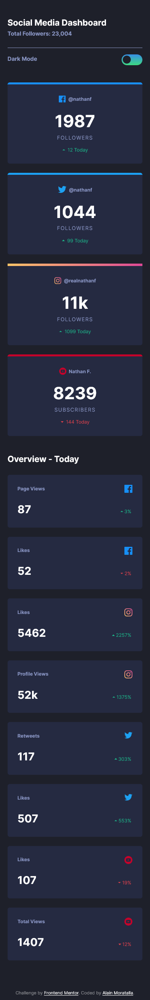

# Frontend Mentor - Social media dashboard with theme switcher solution


This is a solution to the [Social media dashboard with theme switcher challenge on Frontend Mentor](https://www.frontendmentor.io/challenges/social-media-dashboard-with-theme-switcher-6oY8ozp_H). Frontend Mentor challenges help you improve your coding skills by building realistic projects. 

---
## Table of contents

- [Frontend Mentor - Social media dashboard with theme switcher solution](#frontend-mentor---social-media-dashboard-with-theme-switcher-solution)
  - [Table of contents](#table-of-contents)
  - [Overview](#overview)
    - [The challenge](#the-challenge)
    - [Screenshot](#screenshot)
    - [Links](#links)
  - [My process](#my-process)
    - [Built with](#built-with)
    - [What I learned](#what-i-learned)
    - [Continued development](#continued-development)
    - [Useful resources](#useful-resources)
  - [Author](#author)
  - [Acknowledgments](#acknowledgments)

---

## Overview
Greetings Everyone! This project is made for the purpose of practicing and improving my CSS skills. This challenge is setup by [`Frontend Mentor`](https://www.frontendmentor.io/challenges/social-media-dashboard-with-theme-switcher-6oY8ozp_H). To know more about this challenge, read the *challenge.md*.

### The challenge

Users should be able to:

- View the optimal layout for the site depending on their device's screen size
- See hover states for all interactive elements on the page
- Toggle color theme to their preference

**`Difficulty:`**` Junior`

### Screenshot

Screen: `1440x800 light desktop`


Screen: `1440x800 dark desktop`


Screen: `1440x800 light active desktop`


Screen: `1440x800 dark active desktop`


Screen: `375x2387 light mobile`


Screen: `375x2387 dark mobile`


### Links

- Solution URL: [Github repo url](https://github.com/almoratalla/Social-media-dashboard-with-theme-switcher)
- Live Site URL: [My github page](https://almoratalla.github.io/projects/learning/Social-media-dashboard-with-theme-switcher)

## My process

### Built with

- Semantic HTML5 markup
- SASS (scss syntax)
- Flexbox
- CSS Grid
- Mobile-first workflow

### What I learned

This is my first attempt to do a theme switcher so it's really fun to discover that you can achieve this task simply using css variables. Also, I looked up some resources, copied the way they made theme switcher and really liked the way you can change the html element property to set a data-theme property. 

Also, I tried to apply drag events on the dashboard so I can reposition elements by dragging the cards but I didn't took my time to finish it. It may be a possible future revision in this case.

For styling, as always I started with a mobile-first approach: 

```css
html {
    box-sizing: border-box;
    font-size: 100%;
}

*, *::before, *::after{
    box-sizing: inherit;
}

body {
    margin: 0;
    padding: 0;
    max-height: 100%;
}
```

I also implemented css grid this time instead of my usual flexbox. But I think I still like flexbox more.

Since the given designs in the style-guide were created to `375px` and `1440px` for Mobile and Desktop respectively, I added these:


*@For screens* `1920 x 1080` and `1366 width and above` 
*body* `1920px X 1076px/937px` *or* `120rem x 67.25rem/58.6rem`
```css
@media screen and (min-width: 1366px){
...
}
```

Lastly, for sizes relative to the original design, I estimated the sizes by pasting the `jpg` file into AdobeXD and eyeballed its dimensions. 

### Continued development

As mentioned above, this can be continued with the addition of drag and drop api. It will make the dashboard customizable. Another addition for this implementation could be to use apis for each social media to track actual data. This can also be integrated with OAuth2 for auth.

### Useful resources

- [Frontendmentor.io](https://www.frontendmentor.io/resources) - Frontendmentor itself has a list of great resources!.
- [MDN Web Docs](https://developer.mozilla.org/en-US/docs/Web/CSS/Reference) - Great reference for syntax and properties.
- [CSS Tricks! - Flexbox](https://css-tricks.com/snippets/css/a-guide-to-flexbox/) - Something I go back to as a reference for flexbox.
- [CSS Tricks! - Grid](https://css-tricks.com/snippets/css/complete-guide-grid/) - Reference I used in this project for CSS Grid.
- [Google Everything](https://www.google.com/) - You don't know something? Google it! Or any search engine that you prefer. I just mainly use it to go to Stack Overflow lol
- [Stack Overflow](https://stackoverflow.com/) - the ever loving and benevolent!
- [Design Course Vid for Toggle Mode](https://www.youtube.com/watch?v=ZKXv_ZHQ654) - This is my main reference for theme switcher
- [Drag and Drop API](https://developer.mozilla.org/en-US/docs/Web/API/HTML_Drag_and_Drop_API) - This is for future development

## Author

- Website - [Alain Moratalla](https://github.com/almoratalla)
- Frontend Mentor - [@almoratalla](https://www.frontendmentor.io/profile/almoratalla)
- Twitter - [@almoratalla](https://twitter.com/almoratalla)

## Acknowledgments

I tip all the hats in the world for FrontEnd Mentor for giving these challenges. I would also like to thank all the references I used for this project. Thank you very much.